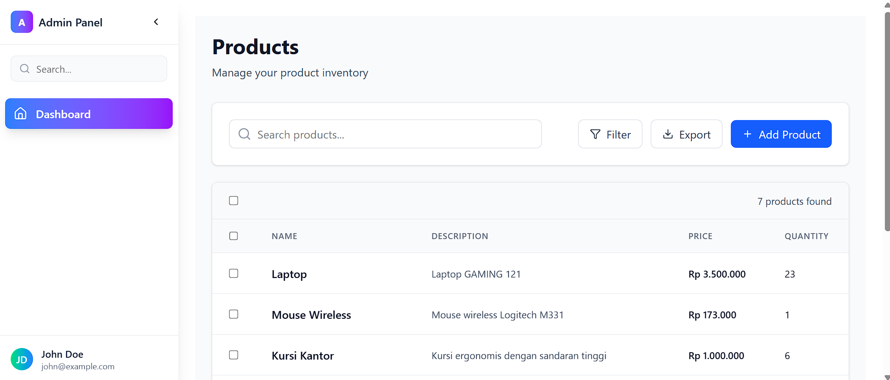
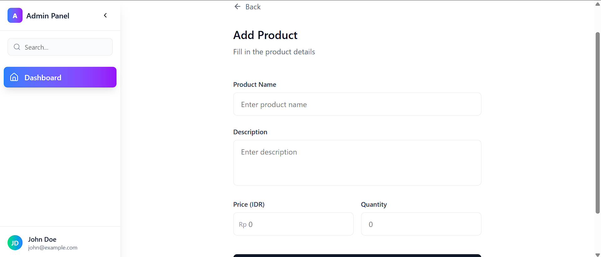
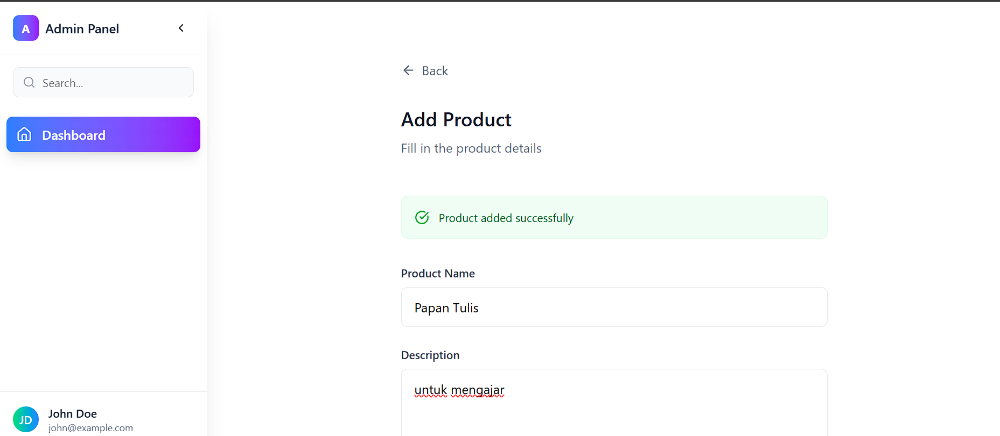
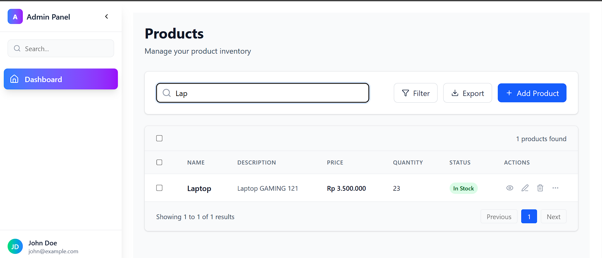
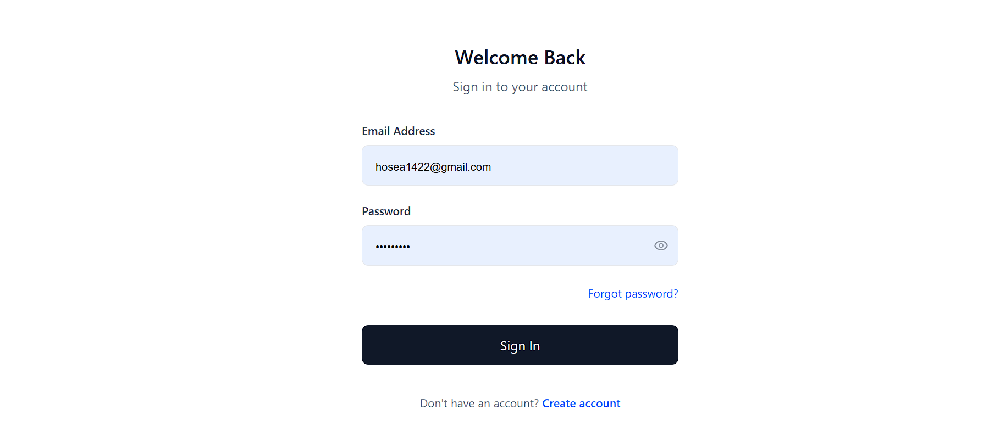
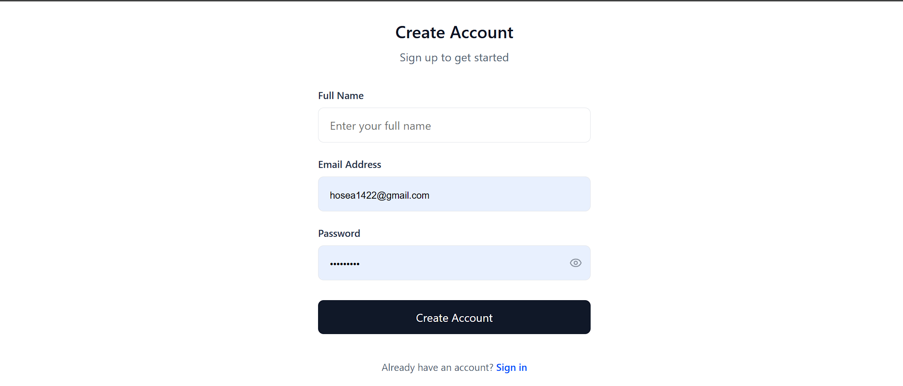

# React Dashboard For Technical Test

This project is a **React-based dashboard** built as part of a technical test. It includes a clean, responsive UI and features such as product listing, searching, sorting, pagination, and CRUD operations (Create, Read, Update, Delete) And Auth.

## 🚀 Features

- Product listing with table view
- Search functionality
- Sortable columns (name, price, quantity)
- Pagination
- Add/Edit/Delete products
- Status indicator for stock level (Low, Out of Stock, In Stock)
- Responsive and modern design using Tailwind CSS
- Icons powered by Lucide React

## Preview

### Dashboard



### Add Product



### Success Add Product



### Search Product



### Login



### Register



## How To Run This Project

1. Clone this repository

```bash
git clone https://github.com/HN721/React-FE.git
```

2. Get into the path

```bash
cd frontend
```

3. Install the dependencies

```bash
npm install
```

4. Run the project

```bash
npm run dev
```

## Contributing

We welcome contributions! 🚀

If you would like to open a Pull Request (PR), please follow these steps:

1. Fork this repository.

2. Create a new branch:

```
git checkout -b feature/your-feature-name
```

3. Make your changes.

4. Commit your changes with a clear message:

```
git commit -m "Add: your featusre description"
Push your branch to your fork:
```

```
git push origin feature/your-feature-name
```

5. Open a Pull Request (PR) to the main branch of this repository.

6. Make sure your code is clean, well-tested, and consistent with the project style.

7. License
   This project is open-source and available under the MIT License.

# Enjoy exploring and contributing to the Survey Application! 🎉
